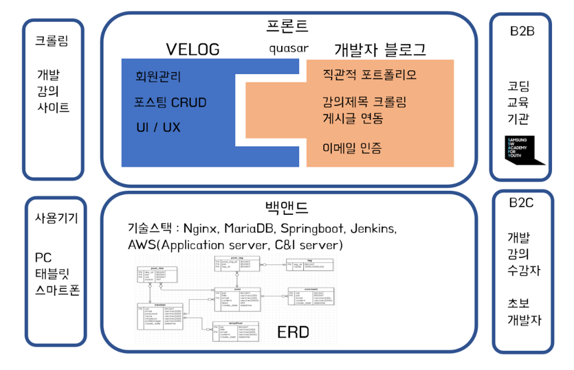
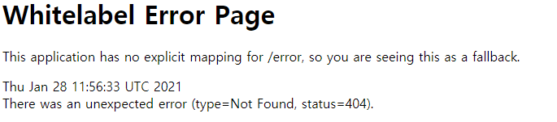
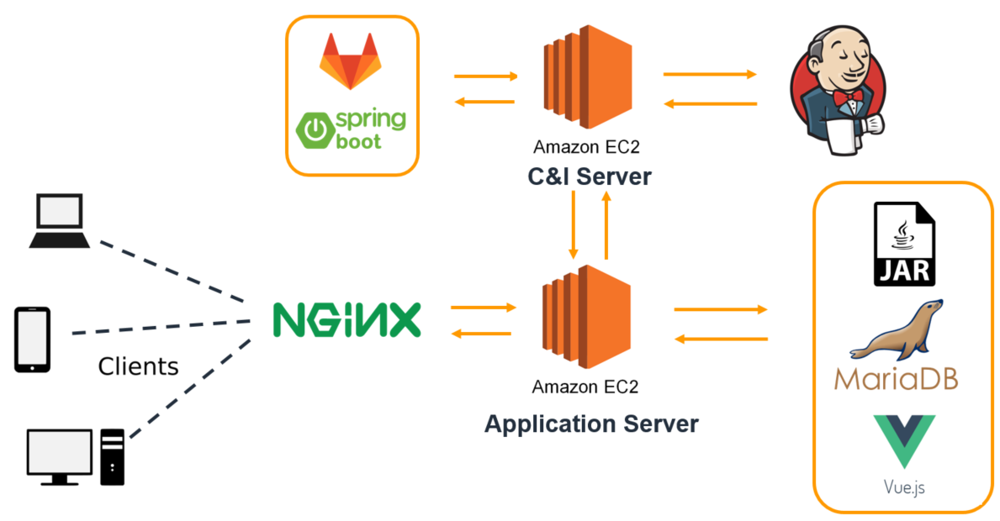
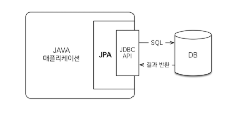
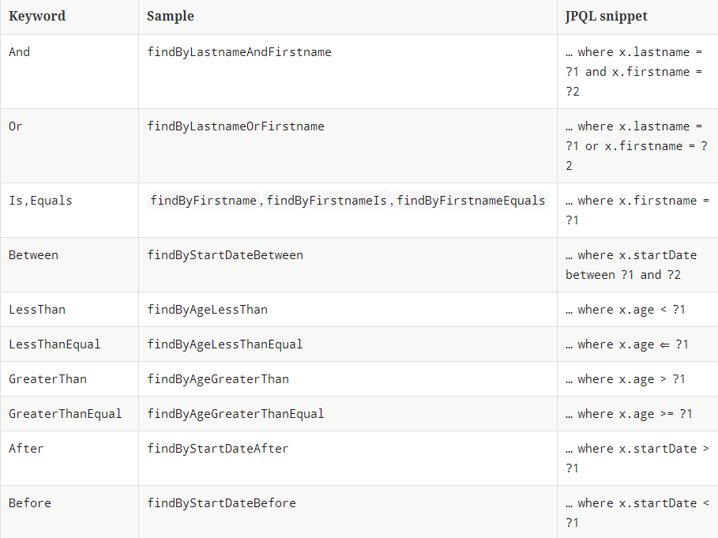
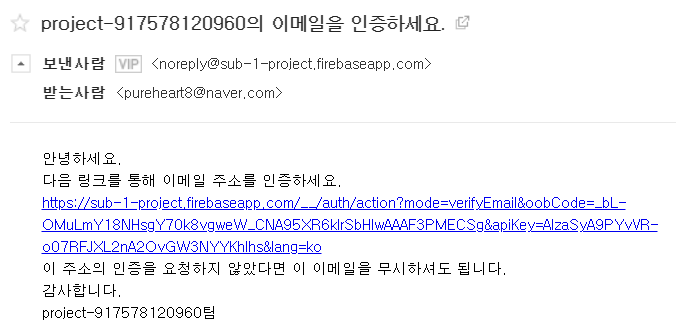
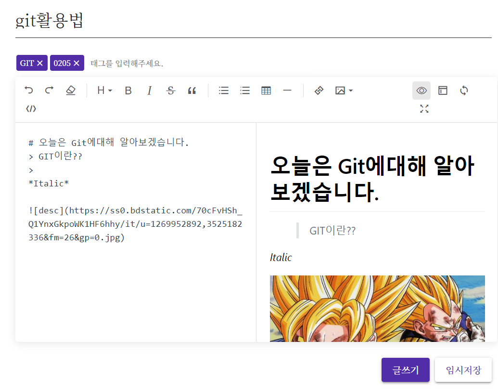
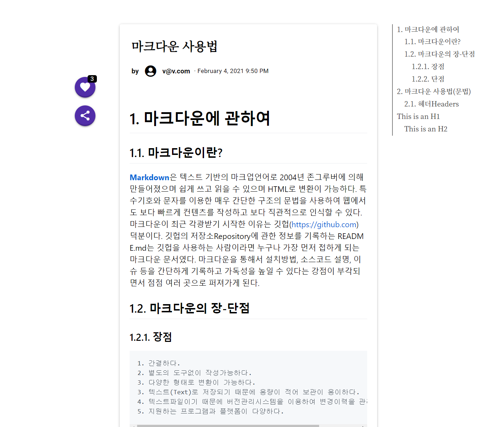
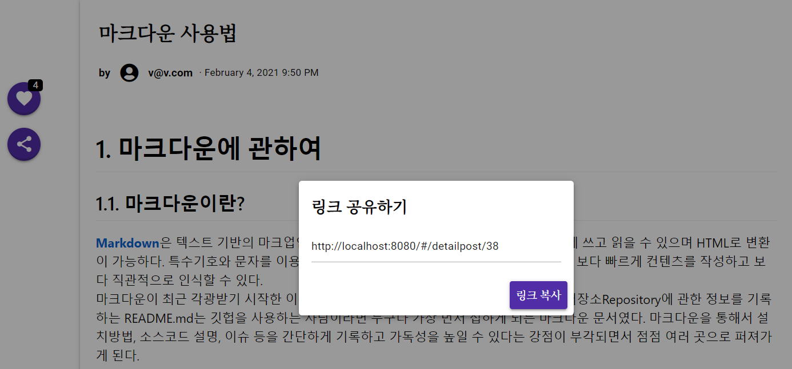

# 😁팀원 소개

#### 최동식

- CTO (Chief Technology Officer)
  - 크롤링 JSOUP 라이브러리 도입
  - 서버 빌드 자동화 및 배포


#### 조우리

- 프론트앤드 개발자
  - 서버 UI/UX 및 데이터 메니저
  - 명세서 맞춤 개발 지향


#### 유석균

- 백앤드 개발자
  - 게시판 모든 기능 CRUD 


# 💕프로젝트 개요

------

## 시퀀스 다이어그램



> **프론트 앤드** 배포사이트 :  [http://i4b103.p.ssafy.io](http://i4b103.p.ssafy.io/)
>
> 마스터 계정 ID : ssafy@ssafy.com
> 비밀번호 : ssafy123
>
> **백앤드** 명세(SWAGGER) : http://i4b103.p.ssafy.io:8080/swagger-ui.html# 


## Sub-Pjt 1 (21.01.11 ~ 21.01.15 <총 1주>)

**목표 : sub1 명세서 기반으로 코딩**

- 팀 프로젝트를 위한 도구 연습. Gitlab, Jira, mattermost 연동
- 팀으로 대응하며 서로 궁금한 점 질문하는 시간 가질 것
- 팀프로젝트 개발 환경 구축(스켈레톤코드 기반)
  


## Sub-Pjt 2 (21.01.18 ~ 21.01.29 <총 2주>)

**이슈** : 팀장 김경림의 퇴소로 인한 결원발생 / 프레임워크 전격 수정

**목표** : 1주차 명세서와 2주차 명세서를 quasar로 구현할 것

- DB 스키마 작성

- 프론트엔드와 백엔드 간 REST API 통신에 대한 이해
- SWAGGER를 사용하여 백앤드 배포
- quasar 프레임워크를 사용하여 명세서 구현 결정
- 회원관리/ 이메일인증/ 로그인/ 게시판 CRUD


## Sub-Pjt 3 (21.02.01 ~ 21.02.19 <총 3주>)

**이슈** : 계획했던 강의제목 크롤링 기능을 도의적 문제로 포기 결정(02.03)

​			컨설턴트님과의 미팅 후 다시 크롤링 기능 사용하기로 결정(02.04)

**목표** : 3주차 명세서 구현 + 3팀만의 차별성 강조

- DB 스키마 작성

- 회원관리/ 이메일인증/ 로그인/ 게시판 CRUD 
- **스킬트리 라이브러리 및 JSOUP 크롤링 학습**
  - https://codesandbox.io/s/jv7pl7wn15 (데모버전)
  - https://www.npmjs.com/package/vue-mindmap


# 🤷‍♂️협업규칙

## 약속

- develop branch에 PUSH할것. Master branch 사용 금지
- 오전 9시반 / 오후 5시 반 매일 팀 미팅을 가지며 어려운 점, 개선 점 피드백 
- JIRA 스토리포인트 관리하기


## 컨벤션

1. Commit 메세지에 Jira와 연동하여 작성한다.

2. 프론트 앤드

   1. Page 폴더 안에 컴포넌트의 기능에 맞게 폴더를 구성한다.

   2. 변수는 `const`를 사용한다.

   3. 파일명은 `PascalCase`로 작성한다.

   4. 파일이름과 컴포넌트 이름은 통일한다.

   5. 함수는 `camelCase`로 작성한다.

      


# Server Build

## AWS 환경 셋팅(maria DB, JDK, mvm, git..)

    $ sudo apt-get install maria-db git mvn java-1.8.0-openjdk 

 


## Backend 배포 및 빌드
    $ git clone https://lab.ssafy.com/s04-webmobile1-sub2/s04p12b103.git
    $ cd s04p12b103/backend 
    $ mvn package                            # jar 파일 생성
    $ cd target
    $ java -jar project-0.0.1-SNAPSHOT.jar   #  backend 빌드

  http://i4b103.p.ssafy.io:8080/ 에서 whitelabel 확인.

  

<br>

 ## NginX를 통한 frontend 배포 및 빌드
    $ sudo apt-get install nginx
    $ cd /etc/nginx/sites-available
    
    # frontend 빌드 파일과 Backend Proxy 설정 
    $ vi default 
    
    # vue 배포 파일 생성 및 frontend 빌드 파일 설정 위치로 이동
    $ npm run build
    $ mv -f dist /var/www/html/
    
    # 서버 주소로 80 포트로 배포된 frontend 파일 로딩.
    $ sudo service nginx start

   


<br>

## Jenkins backend 빌드 및 배포 자동화.


* backend와 frontend 배포시 번거롭고 작업 시간이 소요.
  
* Jenkins를 이용하여 backend 빌드 및 배포.
  
* 새로운 aws instance에 jenkins 빌드 서버 설치.
  
* 서버에서 빌드 성공 시, jar 파일을 운영 서버에 전송.

* 쉘 스크립트를 통하여 기존 서버 종료 후, 전달 받은 jar 파일로 빌드




### 참고자료
[1] https://velog.io/@junho5336/jenkins%EB%A1%9C-%EB%B9%8C%EB%93%9C-%EB%B0%B0%ED%8F%AC%ED%95%98%EA%B8%B0#%EC%84%9C%EB%A1%A0

[2] https://yookeun.github.io/tools/2018/04/14/jenkins-remote/

[3] http://blog.naver.com/PostView.nhn?blogId=chcjswoda&logNo=221024927180


-------------------------------------


# BackEnd

## 1. 구성

### 1.1 Spring Boot & Maven

>* 스프링 부트 설치
>
>* JDK  설치 및 환경변수 설정
>
>  > + 시스템 변수 **JAVA_HOME**에 JDK 설치 경로 설정
>  >
>  > + Path에 **%JAVA_HOME%\bin;** 추가
>  > + java -version 설치 확인
>
>* Maven 설치 및 환경변수 설정 
>
>  > + 시스템 변수 **MAVEN_HOME**에 Maven설치 경로 설정
>  > + Path에 **%MAVEN_HOME%\bin;** 추가
>  > + mvn -v 설치 확인
>
>  

### 1.2 Docker & MariaDB

> * Docker 설치
>
>   >+ https://docs.docker.com/docker-for-windows/install/
>   >
>   >- [ ] **메인보드의 바이오스에서 CPU 가상화 활성화**
>   >- [ ] docker -v 설치확인
>   >- [ ] docker run --name maria-db -p 3306:3306 -e MYSQL_ROOT_PASSWORD={패스워드} -d mariadb
>   >- [ ] docker exec -it maria-db mysql -u root -p
>   >- [ ] MariaDB dependency 추가


------------------------------------


## 2. 기술

### 2.1 JWT

>* **JSON Web Token**의 약자로 전자 서명 된 URL-safe한 JSON
>
>* 서버와 클라이언트 간 정보를 주고 받을 때 Http 리퀘스트 헤더에 JSON 토큰을 넣은 후 
>
>  서버는 별도의 인증 과정없이 헤더에 포함되어 있는 JWT 정보를 통해 인증
>
>* HMAC, SHA256 또는 RSA와 같은 해시 알고리즘을 이용하여 암호화
>
>* 회원 정보를 JWT 토큰으로 만들어 FrontEnd에 전달
>
>

### 2.2 JPA

> * ORM(Object Relational Mapping)으로 관계형 DB를 객체지향적으로 사용하기 위한 기술
> * SQL 쿼리가 아닌 메서드로 데이터 조회 및 조작
> * 객체 간 관계를 바탕으로 SQL을 자동으로 생성



## 3. 기능 구현

### 3.1 회원관리

> * 로그인
> * 회원가입
> * 회원정보 수정
> * 회원정보 확인
> * 회원 탈퇴

### 3.2 게시판

>* 게시글 작성
>
>* 전체 글 목록
>* 상세 페이지
>* 글 수정
>* 글 삭제
>* 키워드 검색

#### Controller 에서 JPA 쿼리 메소드 사용



네임쿼리로 되어있다.

>* @PathVariable, @RequestParam, @RequestBody 등으로 파라미터를 받아올 수 있다.
>* Entity에 값을 전달해 주기 위한 변환과정이 필요


#### 네임쿼리에 정의되지 않은 쿼리를 사용할 때

##### Example

```java
@Query("SELECT p FROM Post p WHERE p.title like %:keyword% "
		+ "or p.content like %:keyword% ORDER BY p.pid desc")
public List<Post> findPostByTitleOrContent(String keyword);
```
myBatis처럼 쿼리매핑을 메소드에 직접 할 수 있다.


-------------------------------------

# FrontEnd

## 1. 구성

### 1.1 Vue

>* Node.js 설치
>
>* Vue cli 설치
>
> > + vue router 추가 설정
> > + vuex 추가 설정
>

### 1.2 Quasar

> * Quasar 설치 
>
> > 1. quasar 검색 (vs 코드에서)
> > 2. npm install -g @quasar/cli  설치
> > 3. quasar create happyhousefinal
> > 4. 프로젝트 세부 설정
> >    	- 프로젝트 이름 설정 (자동완성되어있음) 
> >    	- 프로덕트 이름 설정
> >    	- 프로젝트 설명 설정 
> >    	- 생성한 사람 - 엔터
> >    	- css 프로페서 선택 - none
> >    	- 맨처음꺼 선택
> >    	- eslint, vuex, axios 스페이스바로 선택 후 엔터
> >    	- prettier선택
> >    	- use NPM선택
> > 5. quasar dev 로 실행


------------------------------------


## 2. 기능 구현

### 2.1 회원관리

> * 로그인 이메일 인증
>
>   > firebase 활용, 로그인 시 이메일 인증을 완료한 사용자인지 확인
>
>   ```vue
>   firebase
>     .auth()
>     .signInWithEmailAndPassword(this.email, this.password)
>     .then((response) => {
>       if (response.user.emailVerified) {
>   		// 이메일 인증을 한 경우
>   	} else {
>   		// 하지 않은 경우
>   	}
>   ```
>
> * 회원가입 이메일 인증
>
>   ```vue
>    firebase
>     .auth()
>     .createUserWithEmailAndPassword(user.email, user.password)
>     .then((userCredential) => {})
>     .then(() => {
>       firebase
>         .auth()
>         .currentUser.sendEmailVerification()
>         .then(function() {
>           console.log('이메일 전송');
>         })
>         .catch('이메일 전송 실패');
>         });
>   ```
>
> 예시 사진
>
> 
>
> * 회원가입 약관
>
>   > txt 파일을 vue에서 활용하기 위해서는 별도의 설정 필요함
>
>   ```vue
>   // npm으로 raw-loader 설치
>   import terms from '!raw-loader!../../assets/terms.txt'
>
>   ...
>   data() {
>     return {
>   	terms: terms.split('\n').join('<br />'),
>   	// txt파일을 그대로 사용하면 개행이 적용되지 않음, 적절한 수정 필요
>     }
>   }
>   ```

### 2.2 게시판

>* 게시글 작성 (오픈소스 에디터 활용)
>
>  **예시사진**
>
>
>
>* 상세 페이지 (마크다운 양식으로 출력)
>
>**구현정도 : 상세페이지 내용확인/ 목차기능 / 좋아요/ URL 복사**
>
>

​		

